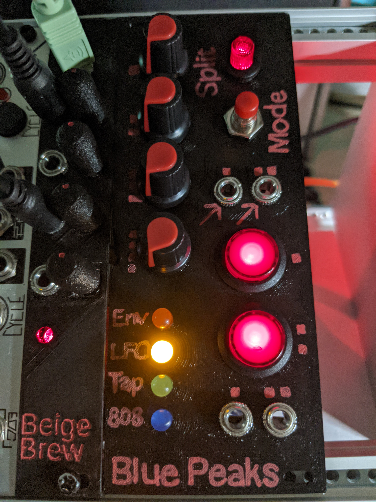
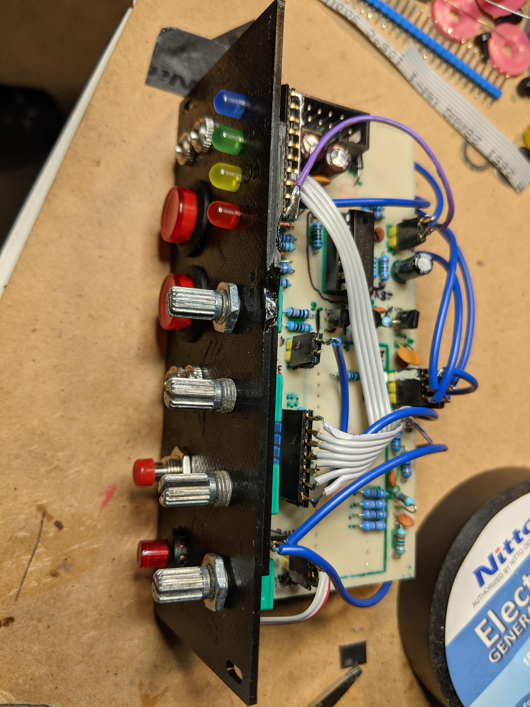
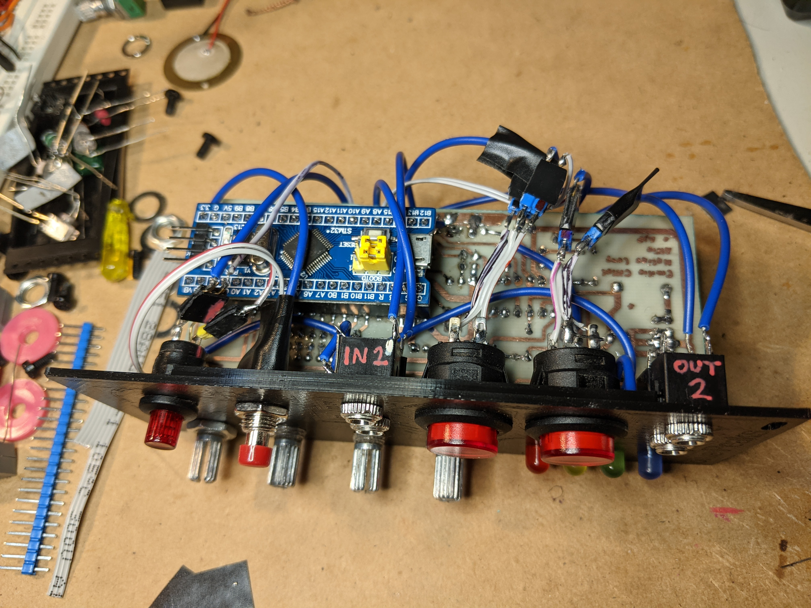

# Blue Peaks

A low-cost remix of [Mutable instrument's Peaks](https://mutable-instruments.net/modules/peaks/) and [Matias Levy Alfie's $peaks](https://github.com/matias-levy/peaks).




## Description
This is a 'skiff friendly' remix of Matias Levy Alfie's awesome [$peaks](https://github.com/matias-levy/peaks) module (which in turn is based on [Mutable instrument's Peaks](https://mutable-instruments.net/modules/peaks/)), with the PCB redesigned with a depth of 50 cm. See [Matias repo](https://github.com/matias-levy/peaks) for details on how he redesigned the module to use a Blue Pill without an external DAC !

It also includes versions of the original Peaks and the Dead Man's Catch firmwares trimmed to fit on a Blue Pill (STM32F103C8T6 dev board) with only 64k of flash. You can use this firmware with Matias' $peaks if you prefer to make that PCB.

Like Matias' original remix, the project is designed to use a single sided home-etched PCB with ~~a couple of~~ far too many jumper wires.
## Firmwares
There's the option to flash one of two firmwares that where ported. The original Mutable Instruments one is in the `firmware/peaks` directory. The [Mutated Mutables Dead Man's Catch](https://github.com/timchurches/Mutated-Mutables/tree/master/peaks) is in the `firmware/peaks2`.

By default the "Number Station" Easter egg in the firmware is disabled to allow it to fit on a Blue Pill with 64k of flash. If you have 128k of flash it can be enabled in the `makefile` (see below).

Compiled binaries and HEX files are provided for both under `firmware/build`.

## Matias changes from Peaks
* Added a driver for the PWM DAC running at **14 bit depth, 48Khz sampling rate.** (File in firmware/peaks/drivers/pwm_dac.h)
* Activated the clock for the TIM4 in firmware/peaks/drivers/system.cc
* **Bypassed the bootloader:** This was done as to simplify the code, it does not interfere with the calibration functionality of the module.
* Redesigned the output portion of the hardware to accommodate to the PWM levels.

## Further changes from $peaks
* Modified board layout to be 'skiff friendly' (PCB is 50mm deep, 110 mm high)
* Disabled the "Number Station" Easter egg by default, to fit in 64k flash.
* Tweaked to use default KiCad footprints, less vertically mounted resistors, use 9mm horizontal Alpha-style pots (eg RD901F / RK09)
* Use 5.1V Zener diodes rather than 3.6V.
* Tweaked tracks to work better for my own PCB production method (pen plotter + etching)

## Build guide

Mine looked like this. You are on your own ... have fun !





Yup, it's a rat's nest. I would love to find the time to redesign further to limit the number of jumper wires.

**WARNING WARNING WARNING** - I found some weirdness in the orientation / side of PCB that some components needed to be soldered in this design. By the time I discovered it I'd already made the PCBs so I worked around it. I ended up soldering the Blue Pill on the opposite side to the other components (awkward), and flipping the transistors, voltage regulator, TL074 and power socket 180 degrees to ensure the pinouts correctly aligned with the approriate tracks / schematic. So fair warning - be paranoid about component orientation and don't blindly trust the silkscreen layer. Visually check that the pins you are soldering make sense with the tracks they connect to (eg wide ground trace). If you don't check carefully as you go, you'd better enjoy desoldering components ....


## Flashing and development
Build with:
```
cd firmware
make -f peaks/makefile
make -f peaks/makefile bin
```

You'll need Python 2.x and `numpy`, as well as a typical Linux build environment for ARM cross-compilation 
(eg On Ubuntu 20.04, do `sudo apt install gcc-arm* build-essential` and set `TOOLCHAIN_PATH = /usr/` in `firmware/peaks/makefile`).

If you happen to have a Blue Pill with 128k of flash, you can enable the "Number Station" Easter egg by uncommenting the `NUMBER_STATION` variable in `firmware/peaks/makefile`.

To make it easier there are pre-compiled binaries and .HEX files in `firmware/build`, this can be flashed directly to the bluepill using [STM32CubeProgrammer](https://www.st.com/en/development-tools/stm32cubeprog.html).

Another option is to install the [mutable-dev-environment](https://github.com/pichenettes/mutable-dev-environment) and replace the peaks folder with the one inside /firmware, then executing

    make -f peaks/makefile upload_serial

We use this command because the bootloader is bypassed.

## Thanks
Many thanks Emilie Gillet for open-sourcing her work which is a constant inspiration for many musicians and makers, and encourage everyone interested in this project to checkout the [Mutable instrument's Forum](https://forum.mutable-instruments.net/) in which Emilie is a very active member.


## TODO, IDEAS

- Resolve issues with flipped components / which side to solder / front vs. back traces.
  - To get correct connections I needed to solder the Blue Pill pin header sockets on the 'wrong' side of the PCB 
    (the opposite side to other components - quite awkward on a single sided PCB),
    and rotate the TL074, transistors and voltage regulator 180 degrees to allow them to be correctly soldered to 
    the 'right' side of the board.
    
- Change some GPIOs in the firmware to make PCB layout easier/cleaner.
- Use a 3.3V supply to power the Blue Pill (eg via LD1117AV33 / LM1117-3.3) rather than 5V - apparently the 5V to 3.3V regulator on Blue Pill boards can't handle more the 100mA, so it's safer to supply 3.3V directly.
- For matching R14/R16 to the Zener reference voltage, 21k and 14k resistors are tricky to find. Either use a 20+1k / 13+1k (or maybe use a resistor + 1k or 2k trimpot to allow manual calibration ?)
- Create a two PCB design with pots/jacks/switches soldered on front board. The single board version is a mess of wires.
- Add CV control for each of the four pots !

While I don't plan to tackle any of these changes within the foreable future, I figured it was worth documenting.